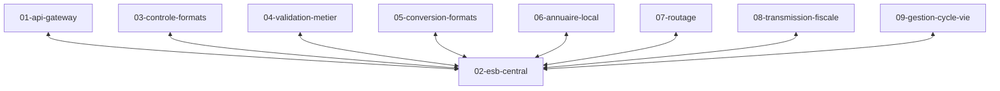

# Specs ESB central

Les briques communiquent via un [bus de message ESB](https://en.wikipedia.org/wiki/Enterprise_service_bus) centralisé.

Les briques ne peuvent communiquer directemet entre elles directement.
Elles doivent passer par le service `02-esb-central`.

Chaque brique consomme les messages d'un canal d'entrée et produit des messages sur un canal de sortie. En cas d'erreur, un message est produit sur un canal d'erreur.

Voici les cas particuliers:
* le service `09-gestion-cycle-vie` qui consomme les messages de tous les canaux de sortie des autres serives
* le service `01-api-gateway` qui n'a pas de canal d'entrée et qui produit des messages sur son canal de sortie à partir des requêtes API
* les services `07-routage` et `08-transmission-fiscale` qui n'ont pas de canal de sortie et qui consomme les messages d'entrée et envoie des requêtes API

Les canaux sont donc:
1. `api-gateway-OUT`
1. `api-gateway-ERR`
1. `controle-formats-IN`
1. `controle-formats-OUT`
1. `controle-formats-ERR`
1. `validation-metier-IN`
1. `validation-metier-OUT`
1. `validation-metier-ERR`
1. `conversion-formats-IN`
1. `conversion-formats-OUT`
1. `conversion-formats-ERR`
1. `annuaire-local-IN`
1. `annuaire-local-OUT`
1. `annuaire-local-ERR`
1. `routage-IN`
1. `routage-OUT`
1. `routage-ERR`
1. `transmission-fiscale-IN`
1. `transmission-fiscale-OUT`
1. `transmission-fiscale-ERR`
