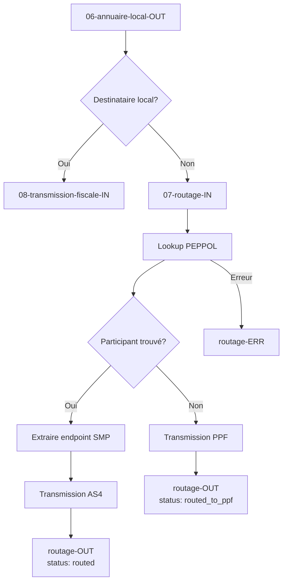

# Specs brique routage

**ATTENTION** : Les fonctionnalités actuellement décrites n'ont pas été validées et sont susceptibles de comporter des erreurs ou lacunes.

La brique de routage est responsable du routage des factures entre les PA (Plateformes Agréées).

## Responsabilités

Le service `07-routage` détermine la destination d'une facture lorsque le destinataire n'est pas enregistré localement :

1. **Découverte PEPPOL** : Interrogation du réseau PEPPOL (SML/SMP) pour localiser la PA du destinataire
2. **Routage AS4** : Transmission de la facture vers la PA distante via le protocole AS4
3. **Fallback PPF** : Si le destinataire n'est pas trouvé sur PEPPOL, transmission vers le Portail Public de Facturation

## Architecture



## Flux de routage détaillé

```
┌─────────────────┐     ┌─────────────────┐     ┌─────────────────┐
│  Facture        │     │  Lookup PEPPOL  │     │  Transmission   │
│  validée        │────▶│  (SML → SMP)    │────▶│  AS4 / PPF      │
└─────────────────┘     └─────────────────┘     └─────────────────┘
                               │
                               ▼
                        ┌─────────────────┐
                        │  SML (DNS)      │
                        │  Localise SMP   │
                        └────────┬────────┘
                                 │
                                 ▼
                        ┌─────────────────┐
                        │  SMP (HTTP)     │
                        │  Métadonnées    │
                        │  - Endpoint     │
                        │  - Certificat   │
                        └─────────────────┘
```

## Canaux NATS

| Canal | Direction | Description |
|-------|-----------|-------------|
| `routage-IN` | Entrée | Reçoit les factures dont le destinataire n'est pas local |
| `routage-OUT` | Sortie | Confirmation de routage réussi |
| `routage-ERR` | Erreur | Échec de routage (participant non trouvé, timeout, etc.) |

## Intégration PEPPOL

Le service de routage utilise le réseau PEPPOL pour la découverte des PA distantes.

### Composants PEPPOL

| Composant | Fonction | Protocole |
|-----------|----------|-----------|
| **SML** (Service Metadata Locator) | Localise le SMP d'un participant | DNS (NAPTR/CNAME) |
| **SMP** (Service Metadata Publisher) | Fournit les métadonnées du participant | HTTP/REST + XML |
| **AS4** | Transport sécurisé des documents | HTTP + SOAP |

### Identifiants français

| Scheme | Type | Format | Exemple |
|--------|------|--------|---------|
| `0009` | SIREN | 9 chiffres | `0009::123456789` |
| `0002` | SIRET | 14 chiffres | `0002::12345678900012` |

### Documentation détaillée

Pour les détails techniques complets (algorithmes, requêtes, code), voir **[peppol.md](./peppol.md)**.

## Tests BDD

| Fichier | Description |
|---------|-------------|
| [pa_multiple.feature](./pa_multiple.feature) | Communication entre multiples PA |
| [peppol.feature](./peppol.feature) | Tests de découverte PEPPOL et routage |

## Statuts de routage

| Statut | Description |
|--------|-------------|
| `routed` | Facture transmise avec succès via AS4 à une PA distante |
| `routed_to_ppf` | Facture transmise au PPF (participant non trouvé sur PEPPOL) |
| `error` | Échec de routage |

## Gestion des erreurs

| Code erreur | Description | Action |
|-------------|-------------|--------|
| `PARTICIPANT_NOT_FOUND` | Participant non enregistré sur PEPPOL | Fallback vers PPF |
| `DOCUMENT_TYPE_NOT_SUPPORTED` | Le participant ne supporte pas ce type de document | Erreur |
| `SML_TIMEOUT` | Timeout DNS | Retry |
| `SMP_UNAVAILABLE` | SMP temporairement indisponible | Retry |
| `AS4_TRANSMISSION_FAILED` | Échec de transmission AS4 | Retry puis erreur |

## TODO

- [x] Documentation PEPPOL ([peppol.md](./peppol.md))
- [x] Tests BDD PEPPOL ([peppol.feature](./peppol.feature))
- [ ] Implémentation du client SML/SMP
- [ ] Implémentation de la transmission AS4
- [ ] Implémentation du fallback PPF
- [ ] Tests d'intégration avec plateformes tierces
  - [ ] [SuperPDP](https://www.superpdp.tech/quick_start.js)
  - [ ] [Autres PDP](https://forum.pdplibre.org/t/mini-auto-benchmark-des-pdp/511)
- [ ] Gestion des retries et circuit breaker
- [ ] Monitoring et métriques

## Liens utiles

### Documentation PEPPOL

- [Spécifications eDelivery](https://docs.peppol.eu/edelivery/) - SML, SMP, AS4
- [France Country Profile](https://peppol.org/learn-more/country-profiles/france/) - Contexte français
- [Peppol Directory](https://directory.peppol.eu) - Annuaire public
- [Documentation France PA](https://openpeppol.atlassian.net/wiki/spaces/FP/overview) - Wiki PEPPOL France

### Contacts

- **Peppol France (DGFiP)** : peppolfrance@dgfip.finances.gouv.fr
- **Chorus Pro (Pagero)** : peppolassist@pagero.fr
- **Service Desk OpenPeppol** : https://peppol.org/tools-support/service-desk/
